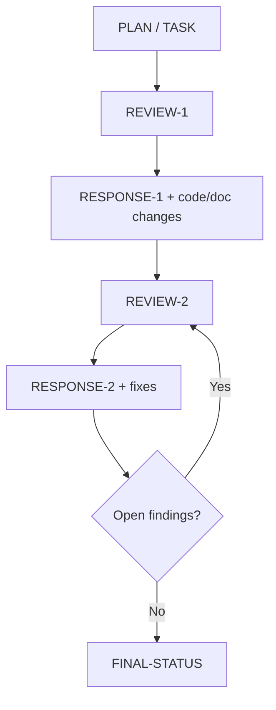

# Цикл и артефакты

## 1. Рекомендуемый цикл

## 2. Типы артефактов

### Плановые

- `TASK-PLAN.md`
- `TASK-PLAN-REVIEW-N.md`
- `TASK-PLAN-RESPONSE-N.md`

### Реализационные

- `TASK-IMPLEMENTATION-REVIEW-N.md`
- `TASK-IMPLEMENTATION-RESPONSE-N.md`

### Завершающие

- `TASK-FINAL-STATUS.md`

## 3. Правила нумерации

- `REVIEW-1` всегда открывает цикл.
- `RESPONSE-1` отвечает только на `REVIEW-1`.
- `REVIEW-2` проверяет:
  - исправления в коде;
  - claims в `RESPONSE-1`.
- номер прохода увеличивается только когда появился новый формальный артефакт.

## 4. Когда нужен новый review-файл

Новый review-файл нужен, если:

- появился хотя бы один новый finding;
- старый finding остался открыт;
- response-файл оказался неточным;
- код исправлен, но документ утверждает больше, чем реально сделано.

Новый review-файл не нужен, если:

- findings нет;
- остались только оговорённые и принятые deferred-пункты вне текущего scope;
- есть только тестовый gap без блокирующего риска, и это явно зафиксировано.

## 5. Что должно быть внутри review-файла

Минимум:

- заголовок прохода;
- дата;
- список findings;
- краткий итог.

Каждый finding:

- severity;
- file:line;
- одна проблема;
- одно последствие;
- без смешения нескольких дефектов в один абзац.

## 6. Что должно быть внутри response-файла

Response-файл должен быть структурирован по findings, а не по файлам.

Для каждого finding:

- статус;
- что изменено;
- где изменено;
- что осталось вне scope.

## 7. Критерии завершения цикла

Задача считается завершённой, если одновременно верно:

- нет открытых `P1` и `P2`;
- все `P3` либо закрыты, либо явно признаны неблокирующими;
- последний review-pass не содержит новых findings;
- последний response не конфликтует с фактическим состоянием кода.

## 8. Частые сбои процесса

### Сбой 1: response переобещивает

Пример: документ пишет «подавляются все события», а код подавляет только часть путей.

Решение:

- отдельный review-pass по response-файлу;
- не считать такой finding кодовым, если кодовая проблема уже закрыта.

### Сбой 2: finding переименован, но не закрыт

Решение:

- оркестратор должен хранить `canonical finding id` или хотя бы карту соответствия.

### Сбой 3: бесконечные мелкие recheck-проходы

Решение:

- разделять:
  - блокирующие замечания,
  - residual risks,
  - document wording issues.
